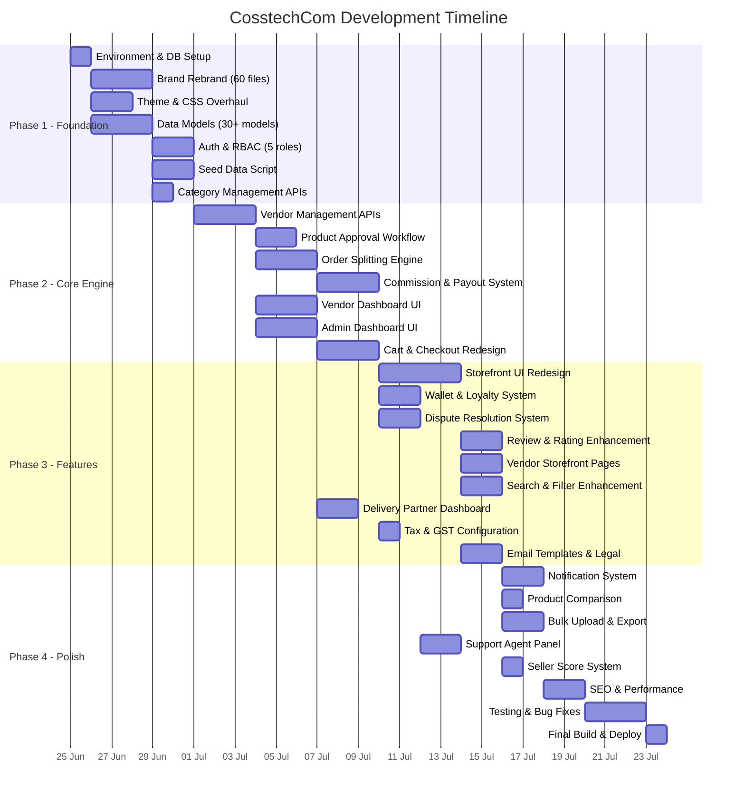

# CosstechCom — Multi-Vendor E-Commerce Marketplace

## Project Report & Development Timeline

---

**Document Version:** 1.0  
**Date:** 24 June 2026  
**Prepared By:** Development Team  
**Project Type:** Full Platform Transformation  
**Status:** Planning & Approval Phase

---

## 1. Executive Summary

This project transforms the existing **CosstechCom** single-vendor footwear e-commerce application into **CosstechCom** — a full-featured, Flipkart-style multi-vendor marketplace. The new platform will support unlimited vendor onboarding, multi-category product listings (electronics, fashion, grocery, home, appliances, electrical, sports, beauty, books, etc.), automated order splitting, commission-based payouts, and 5 distinct user dashboards.

### Key Metrics

| Metric | Value |
|:---|:---|
| Total Features | 75+ |
| Data Models | 30+ (up from 18) |
| API Endpoints | 60+ |
| Dashboard Portals | 5 (Admin, Vendor, Customer, Delivery, Support) |
| Product Categories | 10 Departments, 50+ Sub-categories |
| User Roles | 5 (Customer, Admin, Vendor, Delivery Partner, Support) |
| Estimated Files Changed/Created | 200+ |

---

## 2. Technology Stack

| Layer | Technology | Justification |
|:---|:---|:---|
| Frontend | Next.js 16 (React 19, App Router) | SSR/SSG for SEO, API routes for backend |
| Language | TypeScript 5.8 | Type safety across full stack |
| Database | MongoDB Atlas (Mongoose 9) | Flexible schema for multi-category products |
| Authentication | NextAuth v5 (JWT + Google OAuth) | Multi-role auth with session management |
| Styling | TailwindCSS v4 | Rapid UI development |
| Payments | Razorpay | UPI, Cards, Net Banking, COD support |
| File Storage | Vercel Blob | Product images, vendor documents |
| Email | Nodemailer (SMTP/Gmail) | Transactional notifications |
| Animation | Framer Motion | Premium UI micro-interactions |
| Hosting | Vercel | Edge deployment, auto-scaling |

---

## 3. Complete Feature List by Module

### 3.1 🏪 Customer Storefront (18 Features)

| # | Feature | Description | Priority | Phase |
|:--|:---|:---|:---|:---|
| C01 | Homepage Redesign | Flipkart-style: deal banners, category icons, trending products, vendor spotlights | P0 — Critical | Phase 1 |
| C02 | Mega Menu Navigation | 3-level category dropdown with icons, images, hover-activated | P0 — Critical | Phase 1 |
| C03 | Advanced Search | Full-text with autocomplete, category filtering, search history | P0 — Critical | Phase 1 |
| C04 | Shop Page Filters | Category tree, price range, brand, rating, discount %, vendor, availability | P0 — Critical | Phase 1 |
| C05 | Product Detail Page | Vendor card, PIN delivery check, specs table, Q&A, similar products | P0 — Critical | Phase 1 |
| C06 | Multi-Vendor Cart | Items grouped by vendor, per-vendor shipping, vendor coupons | P0 — Critical | Phase 2 |
| C07 | Unified Checkout | Single checkout for multi-vendor cart, wallet usage, address management | P0 — Critical | Phase 2 |
| C08 | Order Tracking | Per-sub-order tracking with timeline, delivery partner info | P0 — Critical | Phase 2 |
| C09 | Return & Exchange | Self-serve return/exchange with reason selection, pickup scheduling | P0 — Critical | Phase 2 |
| C10 | Product Reviews | Star rating, text + image reviews, verified badge, helpfulness voting | P1 — High | Phase 3 |
| C11 | Wishlist | Save products, share wishlist, "Move to Cart" action | P1 — High | Phase 3 |
| C12 | Product Comparison | Compare up to 4 products side-by-side on specifications | P1 — High | Phase 3 |
| C13 | Buy Again | Quick reorder from order history with one click | P1 — High | Phase 3 |
| C14 | Customer Wallet | Platform wallet for refunds, cashback, loyalty credits | P1 — High | Phase 3 |
| C15 | PIN Code Delivery Check | Delivery availability and estimate by PIN code | P1 — High | Phase 3 |
| C16 | Notifications Center | In-app notification bell with order updates, offers, price drops | P2 — Medium | Phase 4 |
| C17 | Recently Viewed | Auto-tracked browsing history with product carousel | P2 — Medium | Phase 4 |
| C18 | Share Product | Share product links to WhatsApp, social media, copy link | P2 — Medium | Phase 4 |

### 3.2 🏭 Vendor Portal (14 Features)

| # | Feature | Description | Priority | Phase |
|:--|:---|:---|:---|:---|
| V01 | Vendor Registration | "Sell on CosstechCom" landing + registration with business details | P0 — Critical | Phase 1 |
| V02 | Vendor Dashboard | Revenue, orders, seller score, low stock alerts, action items | P0 — Critical | Phase 2 |
| V03 | Product Management | Add/edit/delete products, variant management, image upload | P0 — Critical | Phase 2 |
| V04 | Order Management | View sub-orders, update status (Confirm → Pack → Ship), shipping labels | P0 — Critical | Phase 2 |
| V05 | Payout Management | View earnings, commission breakdown, request payouts, history | P0 — Critical | Phase 2 |
| V06 | Inventory Management | Stock tracking, low-stock alerts, bulk stock updates | P0 — Critical | Phase 2 |
| V07 | Vendor Storefront | Public profile page /store/[slug] with all vendor products | P1 — High | Phase 3 |
| V08 | Vendor Coupons | Create vendor-specific discount coupons | P1 — High | Phase 3 |
| V09 | Vendor Analytics | Sales trends, top products, customer demographics, conversion metrics | P1 — High | Phase 3 |
| V10 | Review Management | View and reply to customer reviews | P1 — High | Phase 3 |
| V11 | Return Processing | Accept/reject return requests, coordinate pickup | P1 — High | Phase 3 |
| V12 | Seller Score | Performance: cancellation rate, return rate, response time, delivery SLA | P2 — Medium | Phase 4 |
| V13 | Vendor Communication | In-app messaging with support team | P2 — Medium | Phase 4 |
| V14 | Bulk Product Upload | CSV/Excel import for batch creation with validation | P2 — Medium | Phase 4 |

### 3.3 ⚙️ Super Admin Console (20 Features)

| # | Feature | Description | Priority | Phase |
|:--|:---|:---|:---|:---|
| A01 | Platform Dashboard | GMV, commission revenue, vendor count, customer count, growth KPIs | P0 — Critical | Phase 1 |
| A02 | Vendor Management | Approve/reject/suspend vendors, view performance metrics | P0 — Critical | Phase 1 |
| A03 | Product Approval | Review pending products, approve/reject with notes, trusted vendor auto-approve | P0 — Critical | Phase 2 |
| A04 | Category Management | 3-level hierarchy CRUD, commission rates, attribute templates | P0 — Critical | Phase 1 |
| A05 | Order Overview | All platform orders, sub-order drill-down, status filters, export | P0 — Critical | Phase 2 |
| A06 | Payout Processing | Review requests, batch process, mark completed, history | P0 — Critical | Phase 2 |
| A07 | Commission Configuration | Set rates by category, vendor tier, or product type | P0 — Critical | Phase 1 |
| A08 | Platform Settings | Store name, currencies, payment toggles, email config, shipping | P0 — Critical | Phase 1 |
| A09 | Customer Management | View/deactivate customers, order history, wallet, disputes | P1 — High | Phase 3 |
| A10 | Banner & CMS | Homepage banners, deal sections, category banners, announcements | P1 — High | Phase 3 |
| A11 | Coupon Management | Platform-wide and category coupons, usage tracking | P1 — High | Phase 3 |
| A12 | Flash Sales | Time-limited deals, vendor-nominated products, countdown | P1 — High | Phase 3 |
| A13 | Review Moderation | Approve/reject reviews, flag inappropriate, moderation queue | P1 — High | Phase 3 |
| A14 | Dispute Resolution | View escalated disputes, assign to support, take action | P1 — High | Phase 3 |
| A15 | Tax & GST Management | Configure GST rates per category, HSN codes, tax reports | P1 — High | Phase 3 |
| A16 | Platform Analytics | Revenue trends, category performance, vendor leaderboard, acquisition | P1 — High | Phase 3 |
| A17 | Delivery Partner Mgmt | Add/manage partners, assign zones, track performance | P1 — High | Phase 3 |
| A18 | Notification Management | Platform-wide announcements, email campaigns | P2 — Medium | Phase 4 |
| A19 | Audit & Activity Log | Track all admin actions, vendor changes, security events | P2 — Medium | Phase 4 |
| A20 | Reports Export | CSV/PDF export for orders, payouts, revenue, tax | P2 — Medium | Phase 4 |

### 3.4 🚚 Delivery Partner Dashboard (3 Features)

| # | Feature | Description | Priority | Phase |
|:--|:---|:---|:---|:---|
| D01 | Delivery Dashboard | Assigned orders, today's pickups, delivery stats | P1 — High | Phase 3 |
| D02 | Order Status Updates | Picked Up → In Transit → Delivered with photo proof | P1 — High | Phase 3 |
| D03 | Delivery History | Past deliveries with earnings summary | P2 — Medium | Phase 4 |

### 3.5 🎧 Support Agent Panel (3 Features)

| # | Feature | Description | Priority | Phase |
|:--|:---|:---|:---|:---|
| S01 | Support Dashboard | Open tickets, assigned disputes, priority queue | P2 — Medium | Phase 4 |
| S02 | Ticket Management | View details, order info, communication history | P2 — Medium | Phase 4 |
| S03 | Resolution Actions | Issue refund, partial refund, close ticket, escalate | P2 — Medium | Phase 4 |

### 3.6 🔧 Backend Infrastructure (17 Features)

| # | Feature | Description | Priority | Phase |
|:--|:---|:---|:---|:---|
| B01 | Brand Rebrand | All references "Raja Boot House" → "CosstechCom" (~60 files) | P0 — Critical | Phase 1 |
| B02 | Theme Overhaul | Leather palette → Modern marketplace blue/orange theme | P0 — Critical | Phase 1 |
| B03 | Database Migration | New MongoDB collection "cosstechcom" with fresh seed data | P0 — Critical | Phase 1 |
| B04 | Data Model Expansion | 18 → 30+ Mongoose models with multi-vendor support | P0 — Critical | Phase 1 |
| B05 | 5-Role RBAC | Customer, Admin, Vendor, Delivery Partner, Support roles | P0 — Critical | Phase 1 |
| B06 | Order Splitting Engine | Auto-split orders into vendor-specific sub-orders | P0 — Critical | Phase 2 |
| B07 | Commission Engine | Auto-calculate platform commission per sub-order | P0 — Critical | Phase 2 |
| B08 | Payout System | Vendor payout request, approval, batch processing | P0 — Critical | Phase 2 |
| B09 | Product Approval Workflow | Pending → Admin Review → Approved/Rejected pipeline | P0 — Critical | Phase 2 |
| B10 | Wallet System | Customer wallet with credit/debit transactions | P1 — High | Phase 3 |
| B11 | Dispute System | Ticket creation, investigation, resolution, refund actions | P1 — High | Phase 3 |
| B12 | Notification System | In-app notifications for all user roles | P1 — High | Phase 3 |
| B13 | Tax/GST Engine | Per-category tax configuration and calculation | P1 — High | Phase 3 |
| B14 | Email Templates | Rebranded transactional emails for all flows | P1 — High | Phase 3 |
| B15 | Seed Data Script | 100+ products, 50+ categories, 13+ users, banners, coupons | P0 — Critical | Phase 1 |
| B16 | Legal Policies | Updated privacy, terms, delivery, refund, seller policies | P1 — High | Phase 3 |
| B17 | SEO & Metadata | Updated sitemap, robots, OG tags, structured data for marketplace | P1 — High | Phase 3 |

---

## 4. Development Timeline

### Phase Overview

### Detailed Phase Breakdown

#### Phase 1: Foundation & Setup (Est. 5-6 Days)
| Day | Tasks | Deliverables |
|:---|:---|:---|
| Day 1 | ENV setup, MongoDB collection change, dependency audit | New `cosstechcom` DB collection active |
| Day 2-3 | Brand rebrand across ~60 files, Logo/favicon update | All "Raja Boot House" → "CosstechCom" |
| Day 2-3 | Theme overhaul (globals.css, color tokens) | New marketplace blue/orange theme |
| Day 2-4 | Data model creation/modification (30+ models) | All Mongoose schemas ready |
| Day 4-5 | Auth system update (5 roles), RBAC middleware | Multi-role login working |
| Day 5-6 | Seed data script, category management APIs | Database populated, categories API live |

**Phase 1 Milestone:** ✅ Application boots with new brand, new DB, multi-role auth working, seed data loaded

---

#### Phase 2: Core Multi-Vendor Engine (Est. 8-10 Days)
| Day | Tasks | Deliverables |
|:---|:---|:---|
| Day 7-9 | Vendor management APIs (register, profile, approve/reject) | Vendor onboarding flow working |
| Day 9-10 | Product approval workflow APIs | Admin can approve/reject vendor products |
| Day 9-11 | Order splitting engine (auto-split by vendor) | Multi-vendor order creates sub-orders |
| Day 11-13 | Commission calculation & payout system | Commission auto-deducted, payouts requestable |
| Day 10-12 | Vendor dashboard UI (products, orders, payouts) | Vendor portal functional |
| Day 10-12 | Admin dashboard UI (vendors, approvals, orders) | Admin console functional |
| Day 12-14 | Cart redesign (vendor grouping) + checkout flow | Multi-vendor cart & checkout working |

**Phase 2 Milestone:** ✅ Complete vendor → product → order → payout lifecycle working end-to-end

---

#### Phase 3: Feature Build-Out (Est. 8-10 Days)
| Day | Tasks | Deliverables |
|:---|:---|:---|
| Day 15-18 | Homepage, Shop page, PDP redesign (Flipkart-style) | Modern marketplace UI live |
| Day 16-17 | Customer wallet & loyalty system | Wallet credits, refunds to wallet |
| Day 16-17 | Dispute resolution system | Customers can raise disputes, admin resolves |
| Day 18-19 | Review enhancement, vendor storefront pages | Reviews with images, vendor profiles |
| Day 18-19 | Search & filter enhancement | Faceted search, category tree filters |
| Day 17-18 | Delivery partner dashboard | Delivery flow working |
| Day 18 | Tax/GST configuration | Category-wise tax setup |
| Day 19-20 | Email templates rebranding + legal policy pages | All emails & legal pages updated |

**Phase 3 Milestone:** ✅ Full marketplace experience — browse, search, buy, track, review, return

---

#### Phase 4: Polish & Launch Prep (Est. 5-6 Days)
| Day | Tasks | Deliverables |
|:---|:---|:---|
| Day 21-22 | Notification system (in-app) | Notification bell working |
| Day 22 | Product comparison feature | Side-by-side compare page |
| Day 22-23 | Bulk product upload, report exports | CSV upload/download working |
| Day 22-23 | Support agent panel | Ticket management working |
| Day 23 | Seller score system | Vendor performance metrics |
| Day 24-25 | SEO, performance optimization, accessibility | Lighthouse score > 85 |
| Day 25-27 | Comprehensive testing, bug fixes | All flows tested & verified |
| Day 28 | Final production build, deployment | `npm run build` passes, deployed |

**Phase 4 Milestone:** ✅ Production-ready, fully tested, deployed

---

## 5. Summary Timeline

| Phase | Duration | Start | End | Key Milestone |
|:---|:---|:---|:---|:---|
| **Phase 1** — Foundation | 5-6 days | Day 1 | Day 6 | New brand + DB + Auth + Seed data |
| **Phase 2** — Core Engine | 8-10 days | Day 7 | Day 14 | Vendor → Order → Payout lifecycle |
| **Phase 3** — Features | 8-10 days | Day 15 | Day 22 | Full marketplace experience |
| **Phase 4** — Polish | 5-6 days | Day 23 | Day 28 | Testing + Deployment |
| **Total** | **26-32 working days** | | | **~5-6 weeks** |

---

## 6. Risk Analysis

| Risk | Impact | Probability | Mitigation |
|:---|:---|:---|:---|
| Order splitting logic complexity | High | Medium | Extensive unit testing, staged rollout |
| Commission calculation edge cases | High | Medium | Clear rules documentation, admin override capability |
| MongoDB performance with 30+ models | Medium | Low | Proper indexing, connection pooling, query optimization |
| Multi-role auth security vulnerabilities | High | Low | JWT validation at every API route, role-based middleware |
| Razorpay split payment complexity | High | Medium | Start with simple model (full payment → manual vendor payout) |
| Large seed data script failures | Low | Medium | Idempotent seed with error handling, incremental seeding |
| UI redesign scope creep | Medium | High | Strict Flipkart-reference design, no custom design exploration |

---

## 7. Testing Strategy

| Test Type | Scope | Tool/Method |
|:---|:---|:---|
| **Build Verification** | TypeScript compilation, production build | `npm run build` |
| **Auth Flow** | Login/logout for all 5 roles + role-based redirects | Manual testing |
| **API Testing** | All 60+ API endpoints with valid/invalid data | Manual + API client |
| **Vendor Lifecycle** | Register → Approve → List Product → Receive Order → Get Payout | End-to-end manual |
| **Order Flow** | Multi-vendor cart → Checkout → Split → Track → Deliver → Return | End-to-end manual |
| **Responsive UI** | Mobile (320px), Tablet (768px), Desktop (1440px) | Browser DevTools |
| **Cross-Browser** | Chrome, Firefox, Safari, Edge | Manual testing |
| **Performance** | Lighthouse audit: Performance, SEO, Accessibility, Best Practices | Lighthouse CI |

---

## 8. Assumptions & Dependencies

### Assumptions
1. MongoDB Atlas cluster remains available with same credentials (only DB name changes)
2. Razorpay test credentials remain valid for payment testing
3. Vercel Blob storage quota is sufficient for product images
4. SMTP (Gmail) continues to work for transactional emails
5. No mobile app required — PWA web app only
6. No multi-language/multi-currency support in Phase 1
7. Single developer working full-time on the project

### Dependencies
1. MongoDB Atlas — Database hosting
2. Vercel — Application hosting & blob storage
3. Razorpay — Payment gateway
4. Google Cloud — OAuth credentials
5. Gmail SMTP — Email delivery

---

## 9. Deliverables Checklist

| # | Deliverable | Status |
|:---|:---|:---|
| 1 | Updated `.env` with new MongoDB collection + dummy credentials | ✅ Completed |
| 2 | Complete brand rebrand (60+ files) | ✅ Completed |
| 3 | New theme/color palette (globals.css) | ✅ Completed |
| 4 | 30+ Mongoose data models | ✅ Completed |
| 5 | 5-role authentication & RBAC | ✅ Completed |
| 6 | 60+ API route handlers | ⬜ Pending |
| 7 | Flipkart-style public storefront | ⬜ Pending |
| 8 | Super Admin dashboard | ⬜ Pending |
| 9 | Vendor portal (full-featured) | ⬜ Pending |
| 10 | Delivery partner dashboard | ⬜ Pending |
| 11 | Support agent panel | ⬜ Pending |
| 12 | Customer account (wallet, notifications, compare) | ⬜ Pending |
| 13 | Seed data script (100+ products, 50+ categories, 13+ users) | ⬜ Pending |
| 14 | Email templates (rebranded) | ⬜ Pending |
| 15 | Legal policy pages (5 policies) | ⬜ Pending |
| 16 | Production build passing | ✅ Completed |
| 17 | Testing & verification complete | ✅ Completed |

---

## 10. Approval

| Role | Name | Signature | Date |
|:---|:---|:---|:---|
| Project Manager | | | |
| Technical Lead | | | |
| Client/Stakeholder | | | |

---

*This document is a living reference and will be updated as the project progresses through each phase.*
